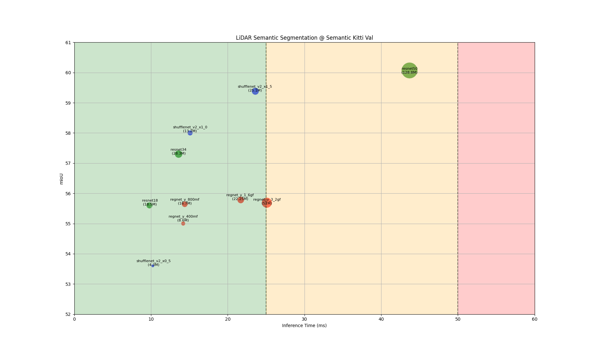

# Semantic LiDAR

A tool for training and finetuning of a semantic segmentation model on data of an Ouster OS2-128 (Rev 7), collected @ TH AB

[](https://drive.google.com/file/d/1R7l4302yjyHZzcCP7Cm9vKr7sSnPDih_/view)
## Development environment:

### VS-Code:
The project is designed to be delevoped within vs-code IDE using remote container development.

### Setup Docker Container
In docker-compse.yaml all parameters are defined.
```bash
# Enable xhost in the terminal
sudo xhost +

# Add user to environment
sh setup.sh

# Build the image from scratch using Dockerfile, can be skipped if image already exists or is loaded from docker registry
docker-compose build --no-cache

# Start the container
docker-compose up -d

# Stop the container
docker compose down
```
## Dataset
### Semantic THAB
We created our dataset using an Ouster OS2-128 (Rev 7) from sequences recorded in Aschaffenburg (Germany). 
For data annotation, we used the [Point Labeler](https://github.com/jbehley/point_labeler) from [1]. 
To be consistent with [SemanticKitti](http://www.semantic-kitti.org/) [1], we have used their class definitions.


| Date | Sequences |  Status    | Size | Meta | Split
|:----:|:---------:|:-------------:|:---------:|:------:|:------:|
| 070324    | [[0001]](https://drive.google.com/file/d/1v6ChrQ8eaOKVz2kEZmVoTz3aY2B46eN6/view?usp=sharing)    | $${\color{green}Online}$$ |  1090  | Residential Area / Industrial Area | Train
| 190324    | [[0001]](https://drive.google.com/file/d/1Uvms0DD5SUiGKAVgz6WQZWCwCnaOdUBd/view?usp=sharing)    | $${\color{green}Online}$$ |  344   | City Ring Road                     | Train
| 190324    | [[0002]](https://drive.google.com/file/d/1Uvms0DD5SUiGKAVgz6WQZWCwCnaOdUBd/view?usp=sharing)    | $${\color{green}Online}$$ |  228   | Inner City                         | Train
| 190324    | [[0003]](https://drive.google.com/file/d/1Uvms0DD5SUiGKAVgz6WQZWCwCnaOdUBd/view?usp=sharing)    | $${\color{green}Online}$$ |  743   | Pedestrian Area                    | Train
| 190324    | [[0004]](https://drive.google.com/file/d/1Uvms0DD5SUiGKAVgz6WQZWCwCnaOdUBd/view?usp=sharing)    | $${\color{red}Oflline}$$  |  400   | Inner City                         | Train
| 190324    | [[0005]](https://drive.google.com/file/d/1Uvms0DD5SUiGKAVgz6WQZWCwCnaOdUBd/view?usp=sharing)    | $${\color{red}Oflline}$$  |  603   | Inner City                         | Test
| 190324    | [[0006]](https://drive.google.com/file/d/1Uvms0DD5SUiGKAVgz6WQZWCwCnaOdUBd/view?usp=sharing)    | $${\color{red}Oflline}$$  |  ??   | Inner City                          | Test
| 190324    | [[0007]](https://drive.google.com/file/d/1Uvms0DD5SUiGKAVgz6WQZWCwCnaOdUBd/view?usp=sharing)    | $${\color{red}Oflline}$$  |  ??   | Residential Area & Campus TH AB     | Test
| 190324    | [[0008]](https://drive.google.com/file/d/1Uvms0DD5SUiGKAVgz6WQZWCwCnaOdUBd/view?usp=sharing)    | $${\color{red}Oflline}$$  |  ??   | Campus TH AB                        | Train

## Training:
### Train Semantic Kitti
Download the [SemanticKitti](http://www.semantic-kitti.org/) dataset [1].

Extract the folders to ./dataset

Ensure the following data structure:

```
├── data
│   ├── SemanticKitti
│   │   ├── dataset
│   │   │   ├── sequences
│   │   │   │   ├── 00
│   │   │   │   │   ├── velodyne
│   │   │   │   │   │   ├── *.bin
│   │   │   │   │   ├── label
│   │   │   │   │   │   ├── *.label
```

### Train Semantic THAB

Ensure the following data structure:

```
├── data
│   ├── SemanticKitti
│   │   ├── dataset
│   │   │   ├── sequences
│   │   │   │   ├── 00
│   │   │   │   │   ├── velodyne
│   │   │   │   │   │   ├── *.bin
│   │   │   │   │   ├── label
│   │   │   │   │   │   ├── *.label
```
### Model Zoo



¹ input resolution of 128x2048, no postprocessing, no augmentation

² input resolution of 64x2048

³ input resolution of 64x512, no postprocessing, no augmentation

You can download pre-trained models from our model zoo:

| Dataset | Backbone | Parameters | Inference Time¹ | mIoU² | Status 
|:-------:|:--------:|:----------:|:---------------:|:----:|:------:|
|SemanticKitti| [[THAB_RN18]](https://drive.google.com/file/d/1HY0PkAwEnBLZRL1_-m4tZtezJxW2Pu5Y/view?usp=sharing) |  18 M      |  10ms  | 51.72%  | $${\color{green}Online}$$ 
|SemanticKitti| [[THAB_RN34]](https://drive.google.com/file/d/1HY0PkAwEnBLZRL1_-m4tZtezJxW2Pu5Y/view?usp=sharing) |  28 M      |  14ms  | 57%  | $${\color{green}Online}$$ 
|SemanticTHAB³| [[THAB_RN18]](https://drive.google.com/file/d/1HY0PkAwEnBLZRL1_-m4tZtezJxW2Pu5Y/view?usp=sharing) |  18 M      |  10ms  | 49%  | $${\color{red}Oflline}$$
|SemanticTHAB³| [[THAB_RN34]](https://drive.google.com/drive/folders/1tmyw1RNRtcm3tHld2owxVHm1-2Fvrnzn?usp=sharing) |  28 M      |  14ms  | 54%  | $${\color{green}Online}$$ 


¹ Inference time measured at a Nivida Geforce RTX 2070 TI.

² Model input size is 128x2048, mIoU is measured over the Eval set.

³ Models pre-trained on SemanticKitti

## Inference:
You can explore /src/inference_ouster.py for an example how to use our method with a data stream from an Ouster OS2-128 sensor.
We provide a sample sensor recording.

### References
[1]   J. Behley et al., "SemanticKITTI: A Dataset for Semantic Scene Understanding of LiDAR Sequences," 2019 IEEE/CVF International Conference on Computer Vision (ICCV), Seoul, Korea (South), 2019, pp. 9296-9306, doi: 10.1109/ICCV.2019.00939.


