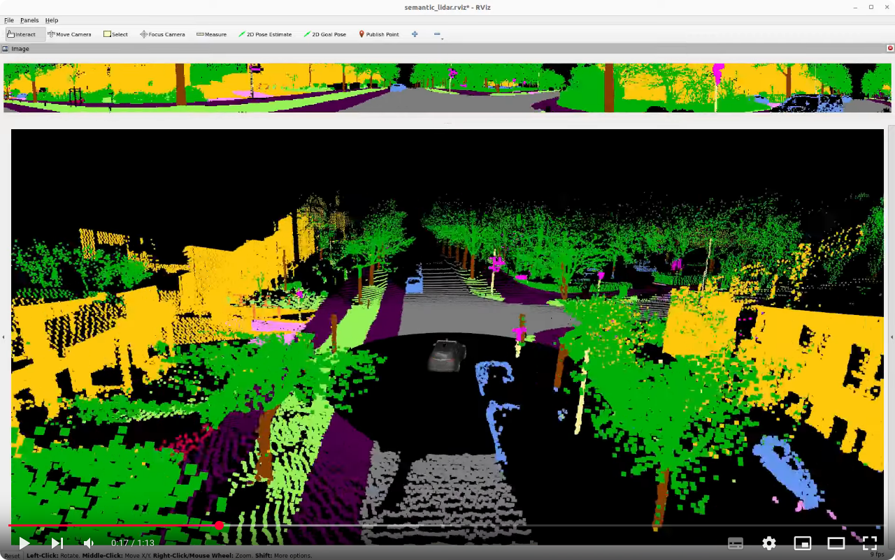

# Real Time Semantic Segmentation of High Resolution Automotive LiDAR Scans [](https://arxiv.org/abs/2504.21602) [](https://www.researchgate.net/publication/391328948_Real_Time_Semantic_Segmentation_of_High_Resolution_Automotive_LiDAR_Scans) [](https://zenodo.org/records/14906179) [](https://github.com/kav-institute/Semantic_LiDAR_ROS)

A tool for training and finetuning of a semantic segmentation model on data of an Ouster OS2-128 (Rev 7), collected @ TH AB
[](https://www.youtube.com/watch?v=d7v6hlMiOuw)

## Abstract

In recent studies, numerous previous works emphasize the importance of semantic segmentation of LiDAR data as a critical component to the development of driver-assistance systems and autonomous vehicles. However, many state-of-the-art methods are tested on outdated, lower-resolution LiDAR sensors and struggle with real-time constraints. This study introduces a novel semantic segmentation framework tailored for modern high-resolution LiDAR sensors that addresses both accuracy and real-time processing demands. We propose a novel LiDAR dataset collected by a cutting-edge automotive 128 layer LiDAR in urban traffic scenes. Furthermore, we propose a semantic segmentation method utilizing surface normals as strong input features. Our approach is bridging the gap between cutting-edge research and practical automotive applications. Additionaly, we provide a Robot Operating System (ROS2) implementation that we operate on our research vehicle.


## Documentation
1. [DATASET](documentation/dataset.md)
2. [EVALUATION](documentation/evaluation.md)
3. [BASELINES](documentation/baselines.md)

## Datasets
See [README.md](dataset/README.md) to learn about the data preperation.

### SemanticKitti 
The SemanticKITTI dataset is a large-scale dataset designed for semantic segmentation in autonomous driving. It contains 22,000+ 3D LiDAR point clouds collected from urban environments. The dataset includes labeled point clouds with 28 semantic classes, such as road, car, pedestrian, and building. It provides ground truth annotations for training and evaluating semantic segmentation algorithms, offering a real-world benchmark for 3D scene understanding in self-driving car applications. The dataset is widely used for developing and testing models that handle point cloud data and scene interpretation in dynamic environments.

### SemanticTHAB [](https://doi.org/10.5281/zenodo.14906179)
The SemanticTHAB dataset can be seen as an extention of the SemanticKITTI dataset for modern and high resoltion 3D LiDAR sensors. It contains 4,000+ 3D LiDAR point clouds collected from urban environments. It shares the label definition with SemanticKITTI.

Download the SemanticTHAB dataset from [https://zenodo.org/records/14906179](https://zenodo.org/records/14906179)

Subject to technical modifications; no responsibility is accepted for the accuracy of this information. Make sure you use the newest version!

## Development environment:
### Reference System
```bash
OS: Ubuntu 22.04.4 LTS x86_64 
Host: B550 AORUS ELITE 
Kernel: 6.8.0-49-generic 
CPU: AMD Ryzen 9 3900X (24) @ 3.800G 
GPU: NVIDIA GeForce RTX 3090 
Memory: 32031MiB                      
```

### VS-Code:
The project is designed to be delevoped within vs-code IDE using remote container development.

### Setup Docker Container 
In docker-compse.yaml all parameters are defined.
```bash
# Enable xhost in the terminal
sudo xhost +

# Add user to environment
sh setup.sh

# Build the image from scratch using Dockerfile, can be skipped if image already exists or is loaded from docker registry
docker compose build --no-cache

# Start the container
docker compose up -d

# Stop the container
docker compose down
```
> [!CAUTION]
> xhost + is not a save operation!
## Training:
### Train Semantic Kitti

Run a single training by:
```bash
appuser@a359158587ad:~/repos$ python train_semantic_Kitti.py --model_type resnet34 --learning_rate 0.001 --num_epochs 50 --batch_size 1 --num_workers 1 --rotate --flip --visualization
```

Run all trainings by:
```bash
appuser@a359158587ad:~/repos$ chmod +x run_training_kitti.sh
appuser@a359158587ad:~/repos$ ./run_training_kitti.sh
```
This will create the following results structure:
```
dataset
└───train_semantic_KITTI
│   └───{backbone}_{model_configuration}
│   |   │   config.json # configuration file
│   |   │   events.out.tfevents.* # tensorflow events
│   |   │   model_final.pth # network weights
│   |   │   results.json # class IoU and mIoU for the eval set
```

### Train Semantic THAB

Run the training by:
```bash
python repos/train_semantic_THAB.py --model_type resnet34 --learning_rate 0.001 --num_epochs 50 --batch_size 8 --num_workers 16 --rotate --flip --visualization
```
This will create the following results structure:
```
dataset
└───train_semantic_THAB
│   └───{backbone}_{model_configuration}
│   |   │   config.json # configuration file
│   |   │   events.out.tfevents.* # tensorflow events
│   |   │   model_final.pth # network weights
│   |   │   results.json # class IoU and mIoU for the eval set
```

Run all trainings including cross validation by:
```bash
appuser@a359158587ad:~/repos$ chmod +x run_training_THAB.sh
appuser@a359158587ad:~/repos$ ./run_training_THAB.sh
```


## Inference:
You can explore /src/inference_ouster.py for an example how to use our method with a data stream from an Ouster OS2-128 sensor.

## ROS Demonstation System
To explore a ROS2 demonstration of our system check out the following repo:
[https://github.com/kav-institute/Semantic_LiDAR_ROS](https://github.com/kav-institute/Semantic_LiDAR_ROS)


<a name="license"></a>


## License:
This project is licensed under the Apache 2.0 License - see the [LICENSE](LICENSE) file for details. Note that the dataset is provided by a different licence!


## Citation:
```
@misc{reichert2025realtimesemanticsegmentation,
      title={Real Time Semantic Segmentation of High Resolution Automotive LiDAR Scans}, 
      author={Hannes Reichert and Benjamin Serfling and Elijah Schüssler and Kerim Turacan and Konrad Doll and Bernhard Sick},
      year={2025},
      eprint={2504.21602},
      archivePrefix={arXiv},
      primaryClass={cs.RO},
      url={https://arxiv.org/abs/2504.21602}, 
}

@dataset{reichert_2025_14906179,
  author       = {Reichert, Hannes and
                  Schüssler, Elijah and
                  Serfling, Benjamin and
                  Turacan, Kerim and
                  Doll, Konrad and
                  Sick, Bernhard},
  title        = {SemanticTHAB: A High Resolution LiDAR Dataset},
  month        = feb,
  year         = 2025,
  publisher    = {Zenodo},
  doi          = {10.5281/zenodo.14906179},
  url          = {https://doi.org/10.5281/zenodo.14906179},
}
```

## Contributors
<a href="https://github.com/kav-institute/SemanticLiDAR/graphs/contributors">
  
</a>
